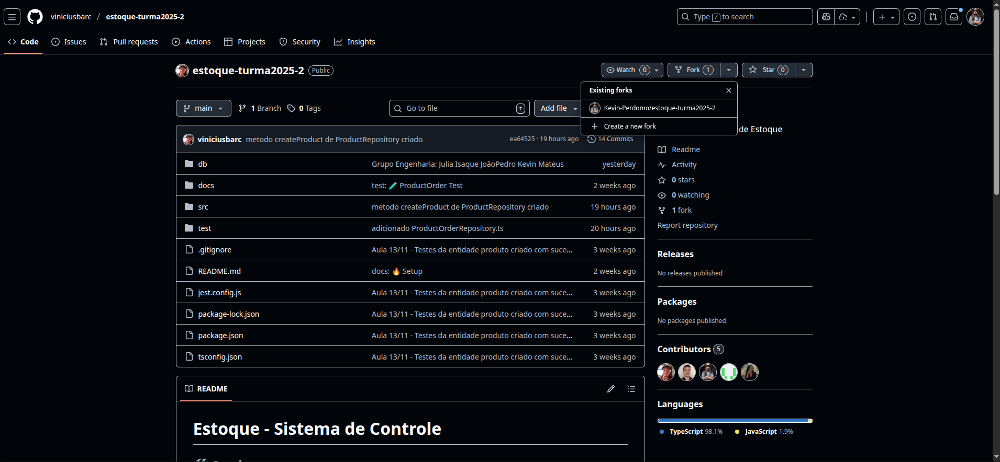
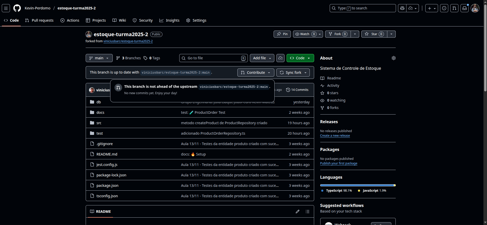
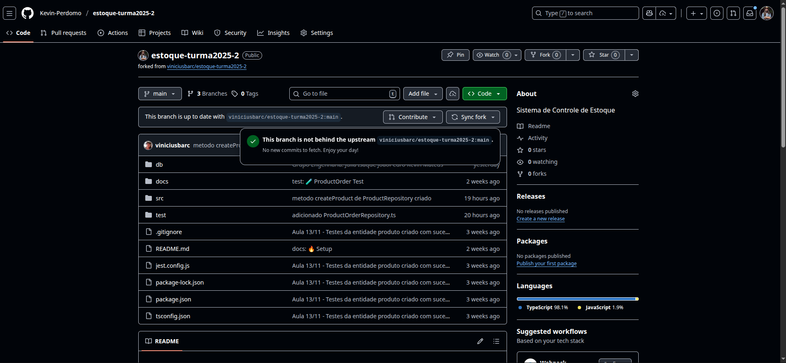

# GitHub: Fork, Branch e Pull Request


## 🍴 Passo 1: Fazer Fork do Repositório

1. Acesse o repositório do professor: https://github.com/viniciusbarc/estoque-turma2025-2

2. Clique no botão **"Fork"** no canto superior direito

   

3. Selecione sua conta do GitHub como destino

4. Aguarde o fork ser criado

5. **Pronto!** Agora você tem uma cópia do repositório na sua conta

---

## 🌿 Passo 2: Criar Branch de Trabalho

### No Terminal:

```sh
# 1. Clone seu fork (substitua SEU-USUARIO)
git clone https://github.com/SEU-USUARIO/estoque-turma2025-2.git

# 2. Entre na pasta do projeto
cd estoque-turma2025-2

# 3. Crie e mude para sua branch de trabalho
git checkout -b grupo-engenharia/sua-feature

# 4. Faça suas alterações e commits
git add .
git commit -m "feat: implementa sua feature"
git push

```

---

## 📤 Passo 3: Fazer Pull Request

1. Vá para o seu fork no GitHub

2. Clique no botão **"Contribute"**

   

3. Clique em **"Open pull request"**

4. Preencha:
   - **Título:** Descrição clara da feature
   - **Descrição:** Detalhes do que foi implementado

5. Clique em **"Create pull request"**

6. **Aguarde** o professor revisar e aprovar

---

## 🔄 Passo 4: Sincronizar Fork Após Aprovação

Depois que o professor aceitar seu PR e fazer merge:

1. Vá para o seu fork no GitHub

2. Clique em **"Sync fork"**

   

3. Clique em **"Update branch"**

4. **Pronto!** Seu fork está atualizado com as mudanças da main

### No Terminal (atualizar localmente):

```sh
# 1. Volte para a branch main
git checkout main

# 2. Puxe as mudanças do seu fork
git pull

```

---

## 🎯 Resumo do Fluxo

```
1. Fork → Copia o repositório do professor para sua conta
   ↓
2. Branch → Cria branch de trabalho no seu fork
   ↓
3. Commits → Implementa e commita suas alterações
   ↓
4. Push → Envia para seu fork no GitHub
   ↓
5. Pull Request → Solicita merge para o repositório do professor
   ↓
6. Aprovação → Professor revisa e aceita
   ↓
7. Sync Fork → Atualiza seu fork com as mudanças
```

---

## 💡 Dicas

- ✅ Sempre crie uma **nova branch** para cada feature
- ✅ Use nomes descritivos: `grupo-engenharia/nome-da-feature`
- ✅ Faça commits pequenos e com mensagens claras
- ✅ Sincronize seu fork regularmente
- ✅ Nunca trabalhe direto na branch `main`

---

## ⚠️ Importante

Antes de começar uma nova feature, **sempre sincronize** seu fork para ter as últimas alterações do professor!
